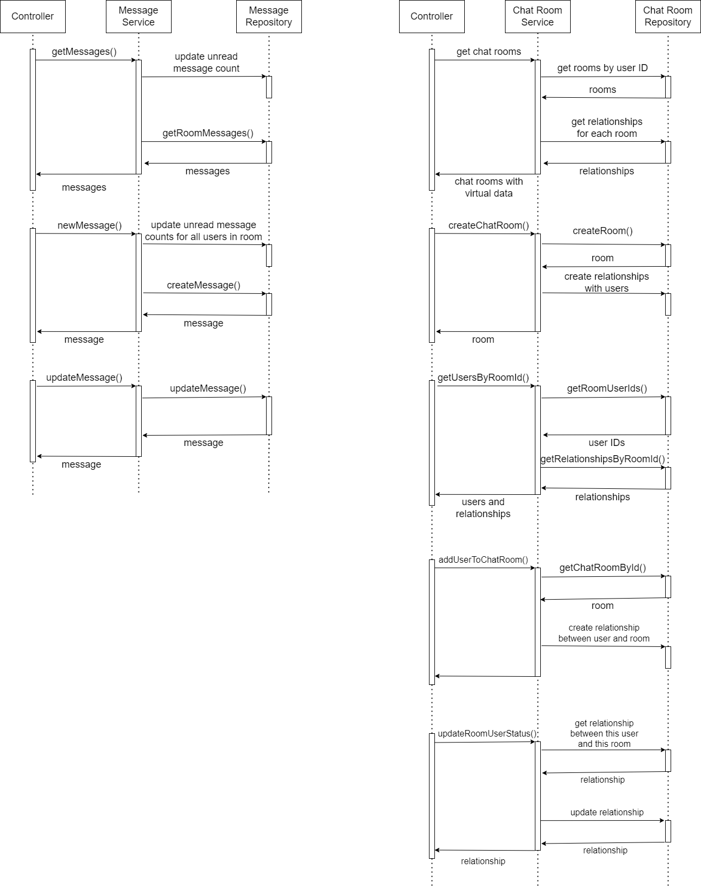

# Description
This is a chat application written using Laravel and React. For WebSocket the application uses Pusher.
# Usage
+ clone repository
+ run `composer install`
+ set up .env file with database credentials as well as Pusher App credentials (see pusher.com). This app uses private (authenticated) Pusher channels for messaging so make sure to select this option in your Pusher app configuration.
+ run `php artisan migrate` and `php artisan db:seed`
+ to start the app, open two consoles and run `php artisan serve` in one and `npm run dev` in another
+ to run the tests run `php artisan test`, yet keep in mind that this resets the current database. You could setup a testing database and use `php artisan config:cache --env=<environment_name>` to switch between local and testing environments

# Documentation



## App\Services\ChatRooms\ChatRoomService

### ChatRoomService::__construct
```
public function __construct(
        private RepositoryInterface $repository,
        private array $screens
    )
```
#### Description
Creates and returns an instance of `App\Services\ChatRooms\ChatRoomService`
#### Parameters
+ a `RepositoryInterface` instance (persistence layer)
+ an array of `ScreenInterface` objects
#### Returns
An instance of `ChatRoomService`
<hr/>

### ChatRoomService::getRooms
```
public function getRooms($userId): Collection
```
#### Description
Retrieves all the rooms that the user specified by `$userId` belongs to.
#### Parameters
+ `int` ID of the user
#### Returns
An `Illuminate\Support\Collection` of `ChatRoomVirtual` objects.
<hr/>

### ChatRoomService::createNewChatRoom
```
public function createNewChatRoom(
    string $roomName,
    int $isPrivate,
    int $userId
): ChatRoom
```
#### Description
Creates a new chat room and creates the appropriate relationships to users.
#### Parameters
+ `string` chat room name
+ `int` 1 or 0 whether chat room is to be private or not
+ `int` ID of the user creating the chat room (moderator)
#### Returns
Newly created `ChatRoom` object.
<hr/>

### ChatRoomService::getUsersByRoomId
```
public function getUsersByRoomId(int $roomId): Collection
```
#### Description
Retrieves all users (and the corresponding relationships) that belong to the chat room specified by chat room ID.
#### Parameters
+ `int` chat room ID
#### Returns
An `Illuminate\Support\Collection` in which:
+ 'users' key refers to an `Illuminate\Database\Eloquent\Collection` of `User` objects
+ 'relationships' key refers to an `Illuminate\Database\Eloquent\Collection` of `RoomUserRelationship` objects that correspond to this room
<hr/>

### ChatRoomService::addUserToChatRoom
```
public function addUserToChatRoom(int $roomId, int $userId): string
```
#### Description
Adds the user specified by ID to the room specified by room ID.
#### Parameters
+ `int` room ID
+ `int` user ID
#### Returns
+ `string` if `ScreenInterface` object detects that the user making the request does not have the required privileges. For example, if the user attempting to add another user to a chat room is not a moderator, the method returns `User is not a moderator of this chat room` message.
+ `string` `Added of already exists` if user is successfully added to the room or already exists in it.
+ `string` `Room is public, cannot add users` if the room is public and therefore all users belong to it.
<hr/>

### ChatRoomService::updateRoomUserStatus
```
public function updateRoomUserStatus(
    int $roomId,
    int $userId,
    int $mute,
    int $ban
): RoomUserRelationship
```
#### Description
Updates user room relationship, i.e. (un)mutes and/or (un)bans the user in specified chat room.
#### Parameters
+ `int` room ID
+ `int` user ID
+ `int` 1 or 0 whether user is to be muted or not
+ `int` 1 or 0 whether user is to be banned or not
#### Returns
The result of the modified `RoomUserRelationship` object.

<hr/>

## App\Services\Messages\MessageService

### MessageService::__construct
```
public function __construct(private MessageRepository $repository, private array $screens)
```
#### Description
Creates and returns an instance of `App\Services\Messages\MessageService`
#### Parameters
+ a `RepositoryInterface` instance (persistence layer)
+ an array of `ScreenInterface` objects
#### Returns
An instance of `MessageService`
<hr/>

### MessageService::getMessages
```
public function getMessages(int $roomId, int $userId): string|Collection
```
#### Description
Retrieves all messages in a chat room by given chat room ID.
#### Parameters
+ `int` ID of chat room to receive messages for
+ `int` ID of the authenticated user making the request through API (can be acquired by Laravel's `Auth::id()`)
#### Returns
+ `string` is returned if one of the `ScreenInterface` objects passed through constructor denies access to the request. Returned value is the resulting error message of the `ScreenInterface` object. For example, if a user, banned in this particular chat room, requests to get messages from this chat room they will see `User is banned in this chat room` message returned.
+ An `Illuminate\Support\Collection` of `MessageVirtual` instances
<hr/>

### MessageService::createMessage
```
public function createMessage(int $roomId, int $userId, string $message): string|ChatMessage
```
#### Description
Creates a new message by user (of provided user ID) in the chat room (by given chat room ID).
#### Parameters
+ `int` ID of the chat room to create message in
+ `int` ID of the user that writes the message (must be the same as authenticated user's ID)
+ `string` message body
#### Returns
+ `string` is returned if one of the `ScreenInterface` objects passed through constructor denies access to the request. Returned value is the resulting error message of the `ScreenInterface` object. For example, if a user, muted in this particular chat room, attempts to post a message in this chat room they will see `User is muted in this chat room` message returned (in this case, message will not be created).
+ `ChatMessage` instance of the newly created message is returned otherwise
<hr/>

### MessageService::updateMessage
```
public function updateMessage(int $messageId, int $authId, string $message): string|ChatMessage
```
#### Description
Updates an existing message given by messageID.
#### Parameters
+ `int` ID of message to be updated
+ `int` ID of authenticated user making the request
+ `string` new message body
#### Returns
+ `string` is returned if one of the `ScreenerInterface` objects passed through constructor denies access to the request. Returned value is the resulting error message of the `ScreenerInterface` object. For example, if a user who is different from the user that created the message attempts to post a message in this chat room they will see `Message does not belong to this user` message returned (in this case, message will not be updated).
+ `ChatMessage` instance of the updated message

<hr/>

## App\Services\Screeners\BanScreener
Implements `ScreenerInterface`.
### BanScreener::screen
```
public function screen(int $roomId, int $userId): bool
```
#### Description
Checks if the user is banned in this chat room.
#### Parameters
+ `int` chat room ID
+ `int` user ID
#### Returns
`true` if the user is banned.

<hr/>

## App\Services\Screeners\ModeratorScreener
Implements `ScreenerInterface`.
### ModeratorScreener::screen
```
public function screen(int $roomId, int $userId): bool
```
#### Description
Checks if the user is not a moderator of this chat room.
#### Parameters
+ `int` chat room ID
+ `int` user ID
#### Returns
`true` if user is not a moderator of this chat room.

<hr/>

## App\Services\Screeners\MuteScreener
### MuteScreener::screen
```
public function screen(int $roomId, int $userId): bool
```
#### Description
Checks if the user is muted in this chat room.
#### Parameters
+ `int` chat room ID
+ `int` user ID
#### Returns
`true` if the user is muted.

<hr/>

## App\Services\Screeners\UserScreener
### UserScreener::screen
```
public function screen(int $authId, int $userId): bool
```
#### Description
Checks if the user making the request is the same as the user specified in the request.
#### Parameters
+ `int` authenticated user's ID
+ `int` user's ID specified in the request
#### Returns
`true` if the provided IDs do not match.

<hr/>

## App\Servives\ChatRooms\Responses\ChatRoomVirtual
### Fields
```
private int $id;
private string $name;
private int $isPrivate;
private int $isBanned;
private int $isMuted;
private int $isModerator;
private int $unreadMessageCount;
```
Includes getters and setters.
### ChatRoomVirtual::__construct
```
public function __construct(ChatRoom $room)
```
#### Description
Creates an instance of `App\Services\ChatRooms\Responses\ChatRoomVirtual`
#### Parameters
+ `ChatRoom` chat room model object
#### Returns
An instance of `ChatRoomVirtual`

<hr/>

## App\Servives\ChatRooms\Responses\MessageVirtual
### Fields
```
private int $id;
private int $chatRoomId;
private int $userId;
private string $userName;
private string $message;
private int $canEdit;
```
Includes getters and setters.
### MessageVirtual::__construct
```
public function __construct(ChatMessage $msg)
```
#### Description
Creates an instance of `App\Services\ChatRooms\Responses\MessageVirtual`
#### Parameters
+ `ChatMessage` message model object
#### Returns
An instance of `MessageVirtual`

<hr/>

## App\Models\ChatMessage
Extends `Illuminate\Database\Eloquent\Model`.
### Properties
+ `int` id
+ `int` chat_room_id
+ `int` user_id
+ `string` message
+ timestamps

<hr/>

## App\Models\ChatRoom
Extends `Illuminate\Database\Eloquent\Model`.
### Properties
+ `int` id
+ `string` name
+ `int` is_private
+ timestamps

<hr/>

## App\Models\RoomUserRelationship
Extends `Illuminate\Database\Eloquent\Model`.
### Properties
+ `int` id
+ `int` room_id
+ `int` user_id
+ `int` is_muted
+ `int` is_banned
+ `int` is_mod
+ `int` unread_count
+ timestamps

<hr/>

## App\Models\User
Extends `Illuminate\Database\Eloquent\Model`.
### Properties
+ `int` id
+ `string` name
+ `string` email
+ `string` password
+ timestamps

<hr/>
